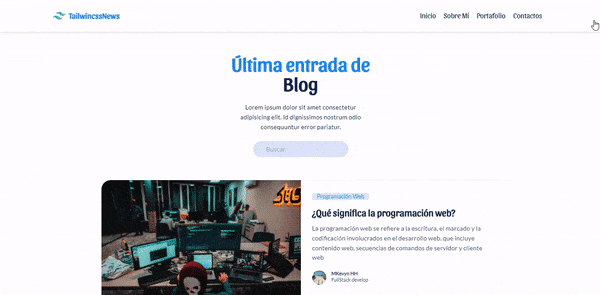

<h1 align="center">Blog con Tailwind CSS, Vite y diseño responsive elegante</h1>

<center>

## 💬 Descripción del proyecto

</center>

<p>Este es un proyecto de un blog desarrollado con Tailwind CSS, Vite y un diseño responsive elegante. Este blog cuenta con las siguientes características:

Diseño responsive elegante que se adapta a diferentes tamaños de pantalla.
Desarrollado con Tailwind CSS, un framework de CSS que permite crear diseños personalizados de manera rápida y eficiente.
Utiliza Vite para construir el proyecto y manejar el flujo de desarrollo.
Utiliza JavaScript moderno para el desarrollo.

</p>
<div align="center">

## 🥇Demo🥇



</div>

## 💎 Tecnologías

- [Tailwincss](https://tailwindcss.com/docs/position)
- [Vite](https://vitejs.dev/)
- [VSCode](https://code.visualstudio.com/)

## 📖 Instrucciones de instalación

### ⚡ Clona este repositorio en tu máquina local:

    ```
      git clone https://github.com/cybertcode/FRONTEND-BLOG-TAILWINDCSS.git
    ```

### ⚡ Entra al directorio del proyecto:

    ``
      cd nombre-del-repo
    ```

### ⚡ Entra al directorio del proyecto:

    ```
      npm run dev
    ```

### ⚡ Entra al directorio del proyecto:

- Abre el navegador y visita http://127.0.0.1:5173/ para ver el blog.

## 👨‍💻 Autores

- [@cybert22](https://www.github.com/cybert22)
- [@cybertcode](https://www.github.com/cybertcode)

## License

[MIT](https://choosealicense.com/licenses/mit/)

[](https://choosealicense.com/licenses/mit/)
[](https://opensource.org/licenses/)
[](http://www.gnu.org/licenses/agpl-3.0)

---

</br>
<div align="center">
<p align="center"> © 2023 Cybertcode, todos los derechos Reservados. Hecho con mucho ❤️ . </p>
<p align="center">
https://www.cybertcode.com
</p>
</div>
